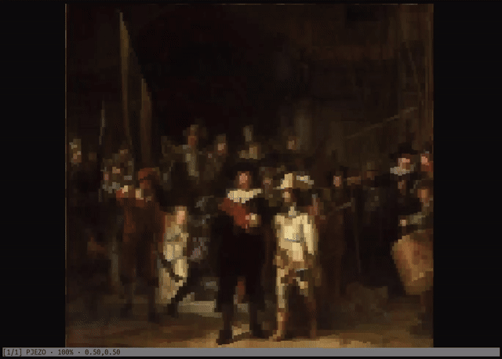

# cliiify

View IIIF manifests and images in the terminal.



Image: Rembrandt van Rijn. _The Night Watch_. 1642. Oil on canvas. Rijksmuseum, Amsterdam. <https://www.rijksmuseum.nl/nl/collectie/object/De-Nachtwacht--3137deb45cd7765f9a76084a16c99544>

## Install

```bash
git clone https://github.com/edwardanderson/cliiify.git
uv tool install --editable cliiify/
```

## Quickstart

View a IIIF presentation manifest:

```bash
cliiify manifest https://iiif.bodleian.ox.ac.uk/iiif/manifest/fd4b8844-8100-4794-a0bb-fb32acd6bf36.json
```

View a single IIIF image:

```bash
cliiify image https://iiif.micr.io/PJEZO
```

> [!NOTE]
> Only pass the image identifier (the IIIF Image API base URI), and not an image request that includes region, size, rotation and quality parameters.

### Controls

| Control    | Key               |
|-           |-                  |
| Pan        | `↑` `←` `→` `↓`   |
| Fast pan   | `Shift +` pan     |
| Zoom in    | `+` or `=`        |
| Zoom out   | `-`               |
| Reset zoom | `0`               |
| Next       | `n` or `PgDn`     |
| Previous   | `p` or `PgUp`     |
| Quit       | `q` or `Ctrl + c` |

## Test

```bash
uv run pytest
```
